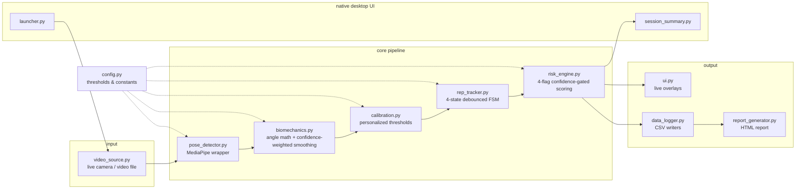

# KinetIQ


**A real-time computer-vision movement-quality and fatigue-monitoring
system.** Analyzes squat form from a live webcam or an uploaded video
using on-device ML pose estimation (MediaPipe), tracks reps with a
debounced state machine, and surfaces asymmetry/instability/fatigue
signals through a confidence-gated risk engine.

> **Not a medical device.** This tool does not diagnose or predict
> injury. It flags patterns (asymmetry, angle instability, shallower
> or slower reps over time) that may be worth a coach's or clinician's
> attention. Treat any RED/YELLOW indicator as "review recommended,"
> never as a diagnosis.

<!--
DEMO: add a screen recording here.
1. Cmd+Shift+5 on macOS -> record the flow: launcher -> live tracking
   overlay -> session-complete popup -> HTML report.
2. Convert to GIF, e.g.: brew install gifski && gifski --fps 12 recording.mov -o docs/demo.gif
3. Drop it (and/or a couple of PNG screenshots) into a docs/ folder,
   then uncomment the line below.
-->
<!--  -->

---

## Results (validated, not claimed)

| Metric | Result | How it was measured |
|---|---|---|
| Rep-counting accuracy | **100%** (6/6 labeled clips) | `validate_reps.py` — debounced FSM vs. a faithful reimplementation of the original naive single-threshold counter, both run on identical calibrated thresholds |
| Risk-flag accuracy | **100%** (14/14 rep-flag checks) | `validate_risk.py` — asymmetry, instability, depth-drop, and speed-drop graded independently against clips with deliberately engineered, known ground truth |
| Confidence-weighted smoothing | **~8x** reduction in noisy-frame influence | Controlled test: a 0.1-confidence outlier frame moved the smoothed signal 0.49° vs. 4.0° under a flat average |
| Unit test coverage | **97%** (63 tests) | Core algorithm modules only — see [Testing](#testing) |

Full methodology, shot lists, and manifests: [`validation/README.md`](validation/README.md).
Honest limitations of these numbers (small sample, self-recorded, one
person) are in [Known limitations](#known-limitations-read-before-trusting-the-output).

---

## Architecture

Refactored from a single ~400-line script into a modular pipeline with
**zero circular dependencies** — `config` sits underneath everything;
`pose_detector`/`biomechanics` depend only on `config`; `calibration`/
`rep_tracker` depend on `biomechanics`'s output; `risk_engine` depends
on `rep_tracker`'s state. UI, logging, and reporting are leaf consumers
of the pipeline — nothing in the pipeline depends on them.



| Module | Responsibility |
|---|---|
| `main.py` | Frame-loop orchestration, ties every module together |
| `config.py` | All thresholds/constants, single source of truth |
| `pose_detector.py` | MediaPipe wrapper (only file that imports `mediapipe` directly); landmark visibility/bounds validation, per-leg confidence scoring |
| `biomechanics.py` | Joint-angle geometry (law of cosines); confidence-weighted temporal smoothing |
| `calibration.py` | Personalized per-athlete threshold derivation (percentile-based, valid-pose-time-based, auto-reset) |
| `rep_tracker.py` | 4-state debounced finite-state machine for rep detection |
| `risk_engine.py` | 4-flag confidence-gated, phase-aware risk scoring |
| `video_source.py` | Unified interface — live camera and uploaded video expose the identical `read()` contract |
| `data_logger.py` | Per-frame + per-rep CSV logging |
| `report_generator.py` / `report_template.html` | Self-contained HTML report — hand-built interactive SVG charts, no charting library dependency |
| `launcher.py` / `session_summary.py` / `ui_style.py` / `tk_utils.py` | Native desktop UI (Tkinter): startup picker, live overlays, post-session summary |
| `camera_utils.py` | Camera device discovery |
| `naive_rep_counter.py` / `validate_reps.py` / `validate_risk.py` | Validation harnesses (see [Results](#results-validated-not-claimed)) |
| `tests/` | 63 unit tests over the pure-logic core (see [Testing](#testing)) |

---

## How it works

0. On launch, a small picker window lets you choose **record live** or
   **analyze an uploaded video file**. Everything downstream behaves
   identically either way — calibration, rep tracking, and risk scoring
   only care about frames + elapsed time, not where they came from.
1. Reads frames continuously (feed always stays visible, even when no
   reliable pose is found).
2. Runs MediaPipe Pose Landmarker on each frame.
3. Computes left/right knee angles from hip-knee-ankle landmarks, each
   weighted by that leg's landmark-visibility confidence before smoothing.
4. Spends the first ~10 seconds of *valid pose time* calibrating to
   your standing and deep-squat angles (do 2-3 clean reps here).
5. Tracks reps with a standing → descending → bottom → ascending
   state machine, with debounce so landmark jitter can't fake a rep.
6. Once a 3-rep baseline is established, flags asymmetry, angle
   instability, shallower reps, and slower reps as they emerge.
7. Logs a per-frame trace and a per-rep summary to CSV under `data/`.
8. Click the **End Session** button in the top-right of the window (or
   press `q`) to stop — or just let an uploaded video play to its end.
9. A native "Session Complete" window pops up with the headline numbers
   (duration, reps, final status). Click **View full report** from there
   to open the full HTML report (charts + CSV downloads) in your browser.

---

## macOS setup

**Use a Homebrew Python, not the system/Command Line Tools one.** macOS's
built-in `python3` links against Apple's bundled Tcl/Tk 8.5, which has been
deprecated since 2009 and has a well-known bug where native windows
(the launcher, the session-complete popup) intermittently render blank
on modern macOS even though they're fully present and clickable. A
Homebrew Python links against a current Tk 8.6 instead, which doesn't
have this problem.

```bash
# 1. One-time: install a Homebrew Python with a modern Tk
brew install python@3.11 python-tk@3.11

cd injury-risk-proj

# 2. Create and activate a virtual environment from that Python
/opt/homebrew/bin/python3.11 -m venv .venv
source .venv/bin/activate

# 3. Install dependencies
pip install -r requirements.txt

# 4. Run it
python main.py
```

Every subsequent run just needs `source .venv/bin/activate` (or invoke
`.venv/bin/python main.py` directly) — no need to repeat the `brew
install` or venv-creation steps.

A picker window opens: choose **Record and get live feedback** (pick a
camera if you have more than one) or **Upload a video file...** (opens a
native file dialog). On first run with a live camera, macOS will prompt
for **Camera** permission for your terminal / IDE. If you don't see the
prompt, grant it manually under **System Settings → Privacy & Security
→ Camera**.

### Useful flags

```bash
python main.py --debug              # print calibration/rep state transitions to the console
python main.py --no-per-frame-log   # skip the per-frame CSV, keep only the per-rep summary
python main.py --no-report          # skip generating the HTML report and the summary popup entirely
python main.py --camera-index N     # record from this camera directly, skip the picker
python main.py --video path/to.mp4  # analyze this video file directly, skip the picker
python main.py --list-cameras       # print detected cameras and exit
```

Click **End Session** (top-right of the window) or press `q` to stop at
any time — or let an uploaded video play to its end.

---

## Output

- `data/session_metrics.csv` — one row per analyzed frame (calibration + tracking phases).
- `data/rep_summary.csv` — one row per completed rep: depth, total/eccentric/concentric duration, speed, and the movement-quality flags active at that moment.
- `data/session_report.html` — charts for knee angle, asymmetry, and per-rep depth/duration, plus download buttons for both CSVs above. Regenerated (overwritten) every run; opened via the **View full report** button in the session-complete popup, not automatically.

---

## Testing

The core algorithm modules (`biomechanics.py`, `calibration.py`,
`rep_tracker.py`, `risk_engine.py`, `naive_rep_counter.py`) are pure
logic with no camera/GUI dependency, so they're covered by a real unit
test suite — 63 tests, 97% statement coverage across those 5 modules.
UI/camera/file-I/O code (`main.py`, `ui.py`, `video_source.py`, etc.) is
covered by the manual/scripted verification described throughout this
README instead, since it needs a real display or camera to exercise.

```bash
source .venv/bin/activate
pip install pytest pytest-cov
python -m pytest tests/ --cov=. --cov-report=term-missing
```

Runs automatically on every push via GitHub Actions
(`.github/workflows/tests.yml`) — see the badge at the top of this file.

---

## Known limitations (read before trusting the output)

- Single-camera 2D pose estimation: no depth, so angles are sensitive to camera angle and body rotation relative to the lens.
- Thresholds (`config.py`) were chosen heuristically, not validated against injury outcomes or a labeled dataset.
- Calibration assumes 2-3 genuinely clean, full-depth reps during the window; a bad calibration produces bad downstream thresholds.
- The fatigue proxy (depth/speed drop vs. an early-session baseline) reflects *this session only* — it has no cross-session or population baseline.
- Designed for a single visible athlete performing bodyweight squats; not tested for other exercises, multiple people in frame, or loaded/barbell variations.
- The validated accuracy numbers above (6 clips, 1 person, similar clean/well-lit conditions) are real but small-sample; the naive-vs-FSM rep counters have not yet shown a measured accuracy *gap* on this footage — only parity — because it doesn't yet contain enough landmark noise to expose the naive method's known weakness.
- This is a research/engineering prototype, not a validated clinical or medical tool.

---

## Roadmap

- Harder-condition validation (dim lighting, distance, occlusion) to produce a genuine measured naive-vs-FSM accuracy delta
- Public web deployment (video-upload mode)
- Long-term direction: multi-player game-film analysis for team-level athlete load/risk monitoring — explicitly scoped as a much harder, different problem (multi-person tracking, player re-identification, broadcast-camera robustness), not a near-term extension of this single-athlete system
